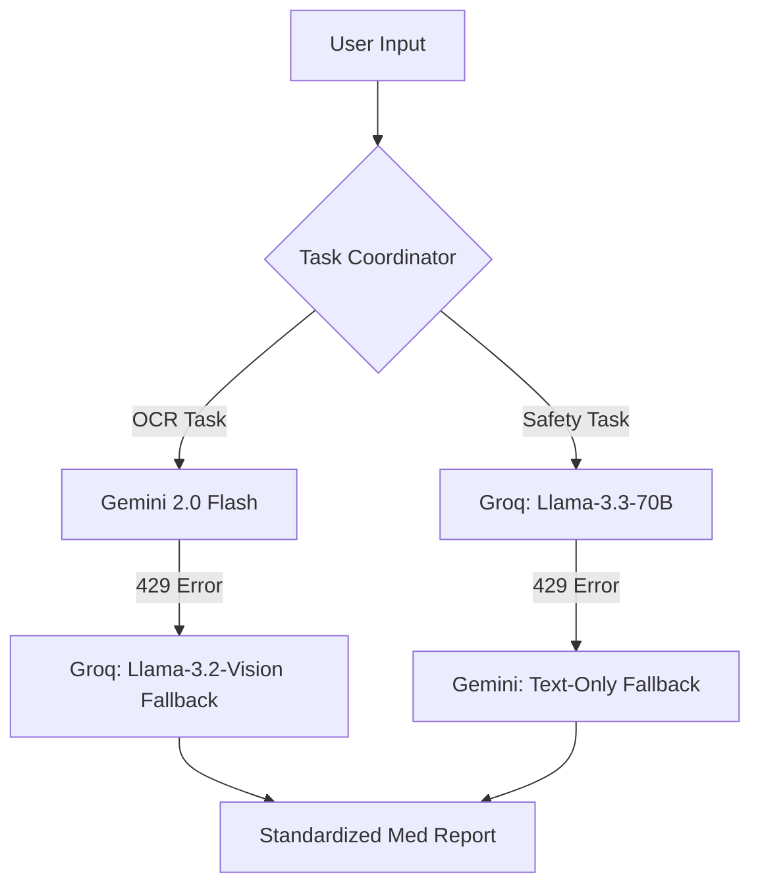

# 🩺 Mediscan Safety Checker
> **Intelligent Medicine Companion powered by Dual-Engine AI.**

<div align="center">

[](https://mediscan-safety.vercel.app/)

<br>


</div>

---

## 🛡️ Triple-Engine Resilience
Mediscan now features a **Bidirectional Fallback system** that makes it almost impossible for the app to fail due to free-tier rate limits.



### 🧠 Why This Matters?
By using **two providers (Google & Groq)** and **three intelligence models**, we ensure:
*   **Zero Downtime**: If Gemini hits an OCR limit, Groq Vision takes over instantly.
*   **Fail-Safe Analysis**: If Groq is busy, Gemini's high-capacity text model provides the safety check.
*   **No Mock Data**: You'll always get a real AI response instead of a generic "too many requests" message.

---

## ✨ Key Features

### 📸 Pro-Grade OCR Scanning
*   **Gemini 2.0 Flash Vision**: Deciphers messy doctor handwriting, blurry medicine strips, and complex labels.
*   **Automatic Extraction**: Converts any photo into a clean list of medicines instantly.

### 🛡️ Deep Safety Analytics
*   **Live Database Connection**: Pings **RxNav** (NIH) and **openFDA** for real-time drug composition and boxed warnings.
*   **Llama-3.3 Reasoning**: Analyzes drug-drug interactions with the medical intuition of a trained pharmacist.

### 🌐 Patient-Centric Design
*   **Simplicity first**: Explains complex pharmacology in "10-year-old" language.
*   **Multilingual Support**: Available in **English, Hindi, Marathi, and Tamil**.
*   **Accessibility**: Built-in **Text-to-Speech (TTS)** with play/pause/stop controls for elderly or visually impaired users.

### 🇮🇳 Indian Context Localization
*   **Local Alternatives**: Suggests 2-3 common Indian medication alternatives if a conflict is detected.
*   **Self-Correction**: Automatically corrects misspelled medicine names using medical context.

---

## 🛠️ Technology Stack

| Component | Technology | Description |
| :--- | :--- | :--- |
| **Frontend** | React + Vite | Blazing fast HMR and optimized builds. |
| **Styling** | Vanilla CSS | Custom Glassmorphism clinical theme. |
| **Vision AI** | Gemini 2.0 Flash | Best-in-class vision for OCR and image reading. |
| **Reasoning AI** | Groq (Llama-3.3) | State-of-the-art token throughput and speed. |
| **Logic** | Node.js + Express | Orchestrates AI and external medical APIs. |

---

## 🚀 Speed Run Setup

### 1. Requirements
*   A **Google Gemini Key** ([Google AI Studio](https://aistudio.google.com/app/apikey))
*   A **Groq API Key** ([Groq Console](https://console.groq.com/))

### 2. Quick Install
```bash
# Clone and install backend
cd backend && npm install

# Clone and install frontend
cd ../frontend && npm install
```

### 3. Configure `.env`
Create a `.env` in the `backend/` folder:
```env
GEMINI_API_KEY=your_gemini_key
GROQ_API_KEY=your_groq_key
```

### 4. Verify & Launch
Run the **Dual-Engine Test** to ensure everything is working:
```bash
node backend/test-dual-engine.js
```
Then start both servers with `npm run dev` in their respective folders.

---

## ⚠️ Disclaimer
**For Informational Purposes Only.** Mediscan is an AI Proof of Concept (POC). **NEVER** use this as a substitute for professional medical advice. Always consult a doctor before taking any medication.


